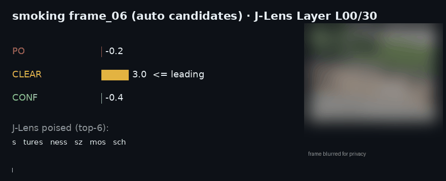
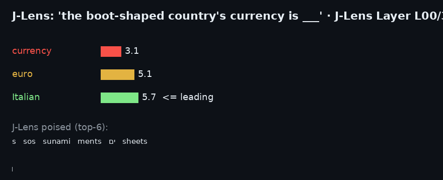
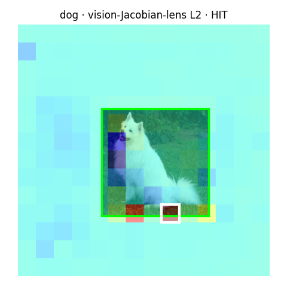
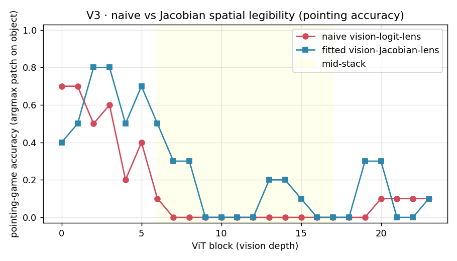

# JLensVL

**A Jacobian-Lens (J-Lens) observer for vision-language models — read what a model is _poised to say_, before it says it.**

<p align="center">
  
</p>

<p align="center"><b><em>One inference, X-rayed.</em></b> A vision-language model is asked <b>“is this person smoking?”</b> and we watch its verdict form <b>layer by layer</b>. The candidate answers — <code>POSSIBLE&nbsp;/&nbsp;CLEAR&nbsp;/&nbsp;CONFIRMED</code> — are <b>auto-detected from the model's own output</b> (no hardcoding). The J-Lens shows <b>POSSIBLE</b> surge mid-stack, then <b>CLEAR</b> fight back, before it commits. The final answer is one word; this GIF is <em>everything that happened to reach it</em> — a single forward pass, no extra inference.</p>

<p align="center"><sub>↑ generated by <code>jl.decision_trace(image, prompt)</code> + <code>viz.decision_gif(...)</code> — works on <em>any</em> "detect X?" task with the same lens.</sub></p>

<p align="center">
  
</p>

<p align="center"><b>The same idea on plain text.</b> Prompt: <code>"…the currency of the boot-shaped country is the ___"</code>. Watch <b>euro</b> — and the <b>latent “Italian”</b> (the boot = Italy) — crystallize across the layers <em>before the model says a word</em>. That's the J-Lens signature: <em>a concept forms in the middle of the network before it's spoken</em> — and here it's legible where the plain logit-lens is noise.</p>

---

### 🆕 Now the lens goes *inside the vision tower*, too

<p align="center">
  
  &nbsp;&nbsp;
  
</p>

<p align="center"><b>What the ViT sees, decoded into words — patch by patch.</b> <code>VisionJLens</code> reads
each of Qwen3.5's <b>24 vision-encoder blocks</b> into the language vocabulary, giving a spatial
<code>[14×14 × vocab]</code> map. <b>Left:</b> the fitted vision-Jacobian-lens's "dog" heat over the merged
patch grid — its argmax patch (white) lands on the animal. <b>Right:</b> pointing-game accuracy across ViT
depth — the Jacobian lens (blue) beats the naive vision-logit-lens (red) at nearly every layer:
best-layer <b>0.80 vs 0.70</b>, and mid-stack (L6–17) <b>0.13 vs 0.01</b>, where the naive lens collapses
as deep merged patches go register/background-dominated. One forward pass.
→ <a href="#vision-tower-j-lens-the-vit-face">Vision-tower J-Lens</a> · <code>examples/12_full_stack.py</code></p>

---

The [Jacobian lens](https://transformer-circuits.pub/2026/workspace/) (Anthropic, 2026) reads an internal activation by transporting it into the final-layer basis with the model's average input→output Jacobian and decoding it with the unembedding:

```
lens_ℓ(h) = unembed( J_ℓ · h )      J_ℓ = E[ ∂h_final / ∂h_ℓ ]
```

It shows the concepts a model holds in its "global workspace" at each layer. **JLensVL brings the J-Lens to _vision-language_ models** — read the lens at image-token positions, post-image text positions, and the answer position — plus concept-competition ("race") analysis and a forward-only **prompt helper**.

> The lens is **forward-only at inference**: `J_ℓ` is fitted once, then every readout is one forward pass + a matmul. No backprop, no per-query gradients.

Built on Anthropic's reference [`jacobian-lens`](https://github.com/anthropics/jacobian-lens) engine (which fits `J_ℓ`, text-only, torch/CUDA); JLensVL adds **VLM support**, concept-race (contradiction) analysis, a template-aware prompt helper, rich self-contained HTML visualizations, an MLX forward-only backend, and native Apple-Silicon (`mps`) support.

---

## Why

Validated on **Qwen3.5-4B** (natively multimodal). Every output below is from a real run.

**1. A concept forms before it's spoken** — the true J-Lens is legible mid-stack where the plain logit-lens is noise:

```
prompt: "Fact: The currency used in the country shaped like a boot is the"
  L20  currency / called / country          logit-lens same layer: baku / 魄 / ernen  (noise)
  L25  euro / Euro / 欧元 / Euros
  L26  euro / Euro / Italian                 ← the latent "Italy" (boot = Italy) surfaces
  L30  Euro / euro / Italian
```

**2. The lens sees what a VLM doesn't say.** Feed a photo of a pug; the model answers just `"dog"`, but the J-Lens reveals it knew it was a **pug**:

```
pug.jpg   model says: 'dog'
  L25  dog / Dog / puppy
  L30  pug / Pug / dog          ← finer latent detail than the 1-word answer
dog.jpg (a black puppy)  →  L29-30: black + dog   (correct attribute, unsaid)
```

**3. Watch vision override a textual lie, layer by layer.** A dog photo, but the text claims it's a cat:

```
                  dog     cat
  L12–21          <       >     cat leads (prior/default)
  L22             >             ← VISION takes over
  L27          30.6    15.8     dog dominates (Δ +14.8)
Stronger textual lie ⇒ crossover delayed (L22→L24) and dog dominance halved. The conflict is quantifiable.
```

**4. Prompt helper — _see_ which phrasing is clearer.** Forward-only ranking of prompt variants by how strongly they steer the model to your intended sense:

```
Prompt-Helper report — intended sense: 'programming'
#1  [coding ctx]  "In software engineering, Java is a"
    programming  |██████████████████████| 21.12   ← intended
    island       |██████████            |  9.19
    → margin +11.94   [✓ CLEAR]
#3  [island ctx]  "On the map of Indonesia, Java is a"
    island       |███████████████████   | 18.50
    programming  |███████████           | 11.00   ← intended
    → margin  -7.50   [✗ OFF-TARGET]
VERDICT: use [coding ctx] — steers to 'programming' with +11.94 margin.
```

---

## Feature matrix

| Capability | Function / API | What it shows |
|---|---|---|
| Text J-Lens trace | `JLensVL.trace(prompt)` | Per-layer top-k J-Lens tokens at a position in a plain text prompt |
| Behavioral reference | `JLensVL.describe(image)` | The model's own short generated answer about an image (a baseline to contrast against the lens) |
| VLM J-Lens trace | `JLensVL.trace_image(image, question)` | J-Lens readout at the answer position, the first post-image text position, and the image-token span |
| Concept race (contradiction analysis) | `JLensVL.concept_race(image, question, concepts)` | Per-layer competition score between named concept sets (e.g. `dog` vs `cat`) — quantifies when/how strongly one overrides the other |
| Prompt poise | `PromptHelper.poised(prompt)` | Top-k tokens the prompt is poised to produce, plus a decisiveness margin (top1 − top2) |
| Prompt ranking | `PromptHelper.rank_prompts(variants, senses, intended)` | Ranks prompt phrasings by how strongly each steers to an intended sense vs. its best competitor |
| Prompt report (ASCII) | `PromptHelper.report(variants, senses, intended)` | Human-readable ASCII-bar version of `rank_prompts`, with a verdict and overall winner |
| Template-faithful trace | `PromptHelper.trace_rendered(messages, senses=...)` | Runs the J-Lens on the **actual chat-template-rendered token sequence** (not a raw string) — per-token trace, special/role tags, and sense scores at the answer position |
| Template A/B comparison | `PromptHelper.compare_templates(base_messages, variants, senses, intended)` | Ranks template configs (system prompt on/off, thinking on/off, few-shot, …) by margin to the intended sense |
| Does the system prompt land? | `PromptHelper.check_system_registers(messages, senses, intended)` | Compares the intended-sense score with vs. without the system message; verdict: registers / no measurable effect |
| Thinking-mode diagnosis | `PromptHelper.diagnose_thinking(messages, senses, intended)` | Compares `enable_thinking=True` vs `False` on intended-sense margin; verdict: helps / hurts / no measurable effect |
| One-click HTML report | `PromptHelper.report_html(base_messages, variants, senses, intended)` | Self-contained HTML: template ranking bars + a token strip of the winning variant |

## Visualization gallery (`jlensvl.viz`)

All of the below return a **self-contained HTML string** (inline CSS/JS, no external dependencies, dark/light theme) and optionally write it to `out_path` — no server needed, works fully offline, open in any browser.

| Function | Produces |
|---|---|
| `viz.slice_grid_html(jl, prompt, layers=...)` | The flagship **layer × position slice grid** for a text prompt: each cell shows the top concept the model is poised to say at that layer/token, colored by confidence; hover any cell for the full top-k **and a per-position sparkline** of how its top-1 score evolves across layers |
| `viz.slice_grid_image_html(jl, image, question)` | The VLM version of the slice grid: image-token positions are collapsed into a single **`[IMG]` band** to stay legible, with full columns for the post-image and answer text positions; hover shows top-k plus the same per-column depth sparkline |
| `viz.race_chart_html(race, concept_a, concept_b)` | An inline-SVG **line chart** of two competing concepts' scores across layers (from `concept_race()` output), with a marked **crossover layer** where one overtakes the other |
| `viz.rendered_strip_html(trace)` | A **token strip** over the real chat-template-rendered sequence (from `trace_rendered()`): special/template tokens highlighted in blue, the answer position outlined in orange, hover any token for the concept it's poised to say |
| `PromptHelper.report_html(...)` | A **one-click prompt-helper report**: grouped horizontal-bar ranking of template variants (intended sense highlighted, margin + verdict per variant) plus a token strip of the winning variant — reuses `viz`'s styling so it looks consistent with the rest of the gallery |

## Install

Needs a CUDA GPU (or Apple Silicon via MPS). For Qwen3.5's Gated-DeltaNet layers, **do not install `fla`/`causal-conv1d`** — the differentiable pure-PyTorch path is what makes the lens fittable.

```bash
git clone https://github.com/neil0306/JLensVL.git && cd JLensVL
python -m venv .venv && source .venv/bin/activate        # or: conda create -n jlensvl python=3.10
pip install -e .          # pulls torch, transformers>=5.13, pillow, torchvision, and the jacobian-lens engine
```

## Run it in 60 seconds (fully reproducible)

Nothing to configure and no local files to prepare. The base model (`Qwen/Qwen3.5-4B`,
public) and **both** fitted lenses (from [`neil0306/JLensVL-lenses`](https://huggingface.co/neil0306/JLensVL-lenses),
public) are downloaded automatically on first run; a demo image ships in the repo.

```bash
# Full stack — the ViT (vision-tower) face AND the LLM-decoder face on one photo:
CUDA_VISIBLE_DEVICES=0 python examples/12_full_stack.py            # defaults to a shipped dog photo
# or your own:  python examples/12_full_stack.py path/to/photo.jpg dog
```

Expected output (real, from `Qwen/Qwen3.5-4B`):

```
### (A) VISION TOWER — VisionJLens over the ViT ###
[A] 'dog' localizes strongest at ViT block L22, merged-patch (row=3, col=4) of the 14x14 grid

### (B) LLM DECODER — JLensVL over the full VLM ###
[B] MODEL says: 'A white dog'
[B] concept race (max-logit per class) across LLM depth:
      block :      dog       cat       car    person
      L25   :    21.12      9.19      4.00      6.44     ← "dog" locks in mid-stack
```

The rigorous vision naive-vs-Jacobian validation (V1 pointing game / V2 emergence / V3
legibility) is one more command:

```bash
CUDA_VISIBLE_DEVICES=0 python examples/11_vision_lens_validations.py
# -> results/vision_lens/: V2_emergence.png, V3_legibility.png, metrics.json, RESULTS.md
```

## Pretrained lenses

Both fitted lenses for `Qwen/Qwen3.5-4B` are published (public) on the Hub and are pulled
automatically by the examples above. To grab them manually:

**[huggingface.co/neil0306/JLensVL-lenses](https://huggingface.co/neil0306/JLensVL-lenses)**

```bash
hf download neil0306/JLensVL-lenses lens_qwen35_4b_final.pt   --local-dir .   # LLM-decoder lens
hf download neil0306/JLensVL-lenses vision_jacobian_lens.pt   --local-dir .   # vision-tower lens
```

Point the code at local copies (skip the download) via env vars:
`JLENSVL_LLM_LENS=/path/lens.pt`, `JLENSVL_VISION_LENS=/path/vlens.pt`,
`JLENSVL_MODEL=/path/to/Qwen3.5-4B`. For the MLX `.npz`, export it yourself with
`scripts/lens_to_npz.py` (see the MLX section). Older `huggingface_hub`: use
`huggingface-cli download`.

## Quickstart

```python
from huggingface_hub import hf_hub_download
from jlensvl import JLensVL, PromptHelper

# fitted LLM-decoder lens (auto-downloaded, cached)
lens = hf_hub_download("neil0306/JLensVL-lenses", "lens_qwen35_4b_final.pt")

# load a VLM (vision tower auto-detected) with the fitted lens
# device="auto" (default) picks cuda if available, else mps (Apple Silicon), else cpu
jl = JLensVL.from_pretrained("Qwen/Qwen3.5-4B", lens=lens)

img = "examples/assets/vision/dog.jpg"               # ships in the repo

# --- vision: what is the model poised to say about an image? ---
print(jl.describe(img))                              # -> 'A white dog'
print(jl.trace_image(img, "What is this?")["answer"][25])   # -> [' Dog', ' dog', ' dogs', ...]

# --- conflict: dog photo, text says cat ---
race = jl.concept_race(img,
                       "This is a cat. What animal is this?",
                       {"dog": ["dog", "puppy"], "cat": ["cat", "kitten"]})

# --- prompt helper: rank phrasings, visually ---
ph = PromptHelper(jl)
print(ph.report(
    {"bare": "Java is a", "coding": "In software engineering, Java is a"},
    senses={"programming": ["programming", "language"], "island": ["island", "province"]},
    intended="programming"))
```

Need a specific device instead of auto-detection? Pass `device="cuda"`, `"cuda:0"`, `"mps"`, or `"cpu"` explicitly — they're honored as given.

Don't have a lens yet? Either [download the pretrained one](#pretrained-lens) above, or fit
your own (does backward passes; ~15 min for a 4B model on a 24 GB GPU, much longer on MPS —
see `examples/09_apple_silicon_check.py` for a quick sanity check before committing to a long
run, and `--checkpoint` to make it resumable):

```bash
python scripts/fit_lens.py --model Qwen/Qwen3.5-4B --out lens.pt --n 100
```

See [`examples/`](examples/) for runnable text, vision, conflict, and prompt-helper demos.

## Vision-tower J-Lens (the ViT face)

`JLensVL` above lenses the **LLM decoder** at image-token positions. `VisionJLens` lenses the
**vision encoder itself** — it reads what each of the 24 ViT blocks of `model.model.visual` is
*poised to say*, decoded into the language vocabulary, at every merged patch → a spatial
`[14×14 × vocab]` map. Two readouts: a **naive vision-logit-lens** (`unembed(merger(h_ℓ))`) and
the fitted **vision-Jacobian-lens** (`unembed(merger(J_ℓ·h_ℓ))`, `J_ℓ = E[∂h₂₃/∂h_ℓ]`).

It loads from a **single public checkpoint** (only the vision tower + merger + tied unembed;
the LLM decoder is never materialised):

```python
from huggingface_hub import hf_hub_download
from jlensvl import VisionJLens

vlens = hf_hub_download("neil0306/JLensVL-lenses", "vision_jacobian_lens.pt")
vl = VisionJLens.from_pretrained("Qwen/Qwen3.5-4B", lens=vlens)

# object-localization heatmap over the merged patch grid, at a given ViT block
heat, ids = vl.object_heatmap("examples/assets/vision/dog.jpg", ["dog"], block=2, use_jacobian=True)
print(heat.shape)        # -> torch.Size([14, 14])   (argmax patch lands on the dog)
```

On the shipped pointing-game validation set, the fitted Jacobian lens beats the naive
logit-lens (`examples/11`): best-layer pointing accuracy **0.80 vs 0.70**, and mid-stack
(L6–17) **0.13 vs 0.01** — the naive lens goes background-dominated mid-stack (Neo et al.'s
register artifact), the Jacobian transport removes it. At the final block `J₂₃ = I`, so the
Jacobian readout equals the naive one there (built-in sanity anchor).

| call | what |
|---|---|
| `VisionJLens.from_pretrained(model_id, lens=..., device=...)` | load vision tower + merger + tied unembed from one public checkpoint |
| `.read_image(image, use_jacobian=...)` | per-block `[P × vocab]` lens logits over the merged patch grid |
| `.object_heatmap(image, words, block=..., use_jacobian=...)` | `[rows × cols]` localization heatmap for an object's token(s) |
| `.fit(images, R=...)` | (re)fit the per-block vision Jacobians `J_ℓ` and store the lens |

Re-fit it yourself (any handful of photos; needs a GPU) with
`python examples/10_fit_vision_lens.py`.

## Visualization quickstart

```python
from huggingface_hub import hf_hub_download
from jlensvl import JLensVL, viz
jl = JLensVL.from_pretrained("Qwen/Qwen3.5-4B",
                             lens=hf_hub_download("neil0306/JLensVL-lenses", "lens_qwen35_4b_final.pt"))

# layer × position "slice grid": what concept each layer holds at each token
viz.slice_grid_html(jl, "…the country shaped like a boot is the",
                    layers=range(16, 31), out_path="slice.html")

# VLM slice grid (image tokens collapsed to an [IMG] band)
viz.slice_grid_image_html(jl, "cat.jpg", "What is this?", out_path="slice_vlm.html")

# concept-race line chart from concept_race() output
race = jl.concept_race("dog.jpg", "This is a cat. What is it?",
                       {"dog": ["dog"], "cat": ["cat"]})
viz.race_chart_html(race, "dog", "cat", out_path="race.html")

# one-click prompt-helper report (ranking + token strip, self-contained HTML)
from jlensvl import PromptHelper
ph = PromptHelper(jl)
ph.report_html(
    base_messages=[{"role": "user", "content": "Java is a"}],
    variants={"bare": {}, "coding": {"messages": [{"role": "user", "content": "In software engineering, Java is a"}]}},
    senses={"programming": ["programming", "language"], "island": ["island", "province"]},
    intended="programming", out_path="prompt_report.html")
```

See the gallery table above for what each output looks like. See `examples/06_visualize.py`.

## MLX backend (Apple Silicon, forward-only)

The Jacobian `J_ℓ` is fit **once, offline** (on CUDA or Apple MPS via torch); applying the
lens at inference is **forward-only** (`unembed(norm(J_ℓ · h))`). So on Apple Silicon you
don't need a custom Metal backward kernel for Qwen3.5's Gated-DeltaNet layers at all — you
just load the fitted `J_ℓ` into MLX and do a native MLX forward + a matmul:

```bash
# 1) fit J_ell offline (torch; do NOT install fla so GDN stays differentiable)
python scripts/fit_lens.py --model Qwen/Qwen3.5-4B --out lens.pt --n 100
# 2) export to a plain .npz MLX can read
python scripts/lens_to_npz.py lens.pt lens_jl.npz
# 3) install the MLX extra:  pip install mlx mlx-lm tokenizers
```

Or skip steps 1–2 and grab the already-exported `lens_jl.npz` from the
[pretrained lens](#pretrained-lens) above.

Then use the `MLXJLens` class (import-safe on non-Apple machines; `mlx`/`mlx_lm` load lazily):

```python
from jlensvl import MLXJLens
jl = MLXJLens.from_pretrained("mlx-community/Qwen3.5-4B-4bit", "lens_jl.npz")
print(jl.trace("… the country shaped like a boot is the")[30])   # -> ['Euro', 'euro', …, 'Italian']
jl.slice_grid_html("… boot is the", out_path="slice.html")        # native-MLX slice grid HTML
```

In an MLX-only environment (no torch) `from jlensvl import MLXJLens` still works — the
torch-backed `JLensVL`/`PromptHelper` are simply `None` there. See `examples/05_mlx_forward_lens.py`.

Verified: the MLX forward-only lens reproduces the same `currency → euro → Italian`
readout as the torch lens — sub-second per forward, no `custom_gdn_vjp` Metal kernel.
Loading the MLX model sidesteps a `mlx_lm`/transformers-5.x clash by using
`mlx_lm.utils.load_model` + the raw `tokenizers` lib (see the example).

## API

| call | what |
|---|---|
| `JLensVL.from_pretrained(id, lens=..., device="auto")` | load model (+processor) and a fitted lens; auto-detects a vision tower; `device="auto"` picks cuda → mps → cpu |
| `.fit(prompts)` / `.save_lens(path)` | fit `J_ℓ` on a corpus and save |
| `.trace(prompt)` | per-layer top-k J-Lens tokens for a text prompt |
| `.describe(image)` | the model's own short answer (behavioral reference) |
| `.trace_image(image, q)` | J-Lens at the answer, post-image, and image positions |
| `.concept_race(image, q, concepts)` | per-layer competition between concept sets |
| `PromptHelper.poised(prompt)` | what the prompt is poised to say + decisiveness margin |
| `PromptHelper.sense_scores(prompt, senses)` | J-Lens score of each candidate sense at the answer position |
| `PromptHelper.rank_prompts(variants, senses, intended)` | rank phrasings by intended-sense dominance |
| `PromptHelper.report(...)` | the same, as a visual ASCII-bar report |
| `PromptHelper.trace_rendered(messages, senses=...)` | J-Lens on the real chat-template-rendered tokens, with per-token trace + sense scores |
| `PromptHelper.compare_templates(base_messages, variants, senses, intended)` | A/B different template configs (system prompt, thinking, few-shot) |
| `PromptHelper.check_system_registers(messages, senses, intended)` | does the system message measurably change the answer-position score? |
| `PromptHelper.diagnose_thinking(messages, senses, intended)` | does enabling thinking mode help/hurt the intended sense? |
| `PromptHelper.report_html(...)` | self-contained HTML prompt-helper report (ranking + token strip) |
| `viz.slice_grid_html(jl, prompt, ...)` | HTML layer×position slice grid for a text prompt |
| `viz.slice_grid_image_html(jl, image, question, ...)` | HTML slice grid for a VLM, image tokens collapsed to `[IMG]` |
| `viz.race_chart_html(race, concept_a, concept_b, ...)` | HTML/SVG line chart of a `concept_race()` result |
| `viz.rendered_strip_html(trace, ...)` | HTML token strip over a `trace_rendered()` result |

## Caveats (honest)

- The lens reads *poised-to-say* content; it correlates with output but is not a perfect predictor. Use it as a **diagnostic**, with controls (baselines, aggregates), not a ground truth.
- The raw **logit-lens** is noisy mid-stack on these models — that's exactly why the fitted **Jacobian** lens exists.
- Needs **white-box** access (weights + a fitted lens). It won't work against a closed API.
- The prompt helper compares/diagnoses phrasings; it does not auto-generate prompts.

## Credits

- **J-Lens & the fitting engine:** [anthropics/jacobian-lens](https://github.com/anthropics/jacobian-lens) and the paper [*Verbalizable Representations Form a Global Workspace in Language Models*](https://transformer-circuits.pub/2026/workspace/) (Transformer Circuits, 2026).
- Prior multimodal exploration: [jerrickhoang/jlens-qwen-jspace](https://github.com/jerrickhoang/jlens-qwen-jspace); Apple-Silicon MLX port: [WeZZard/jlens-qwen36](https://github.com/WeZZard/jlens-qwen36).

JLensVL's contribution is the packaged **VLM** layer (multimodal readout, concept-race, prompt helper) on top of that engine.

## License

Apache-2.0. See [LICENSE](LICENSE).
